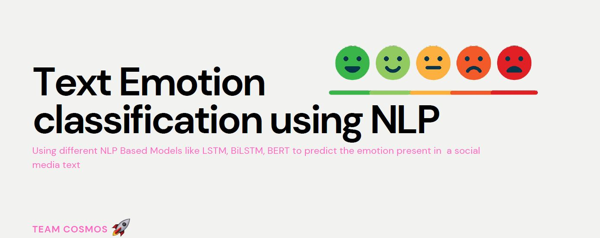

# TextEmotionClassifier
A Text classification-based methodology to predict the emotion of the given text.

- Experimented with three approaches -
1. BiLSTM model (baseline with randomized embedding)
2. BiLSTM with Pretrained ELMo Embeddings
3. BERT
- Achieved best accuracy of 91.3% on the test dataset.
- Added LIME for Model explainability.

----
Video Presentation
